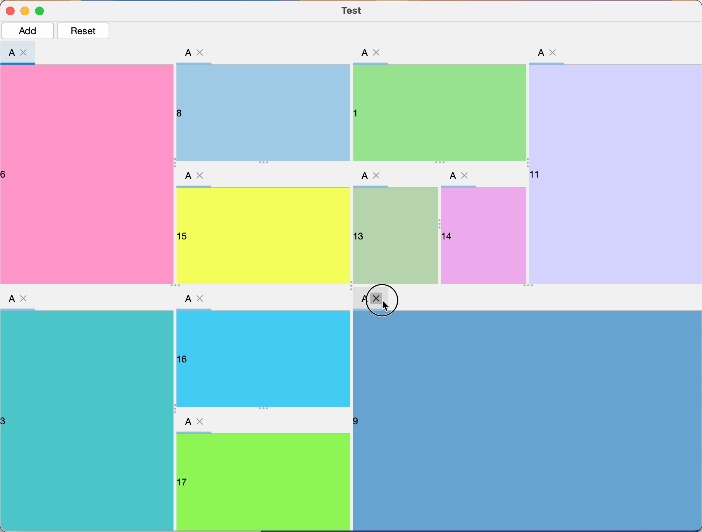

# swkit

它是一个 Java Swing 的 UI 工具包，它基于 [FlatLaf](https://github.com/JFormDesigner/FlatLaf) 封装了一些实用的组件。目前，它
**不是一个完善、安全、实用** 的类库。

## Components

### TabbedPane

## Licensing

本项目采用双许可协议：

1. **AGPLv3**: 如果您将此库用于开源项目，您可以根据 [LICENSE](LICENSE) 协议自由使用。
2. **商业许可**: 如果您想在闭源或专有软件中使用该库，请联系我以获取商业许可证。

----

This project is dual-licensed:

1. **AGPLv3**: You are free to use this library under the [LICENSE](LICENSE) in open-source projects.
2. **Commercial License**: If you would like to use this library in a closed-source or proprietary project, you must
   purchase a commercial license.
